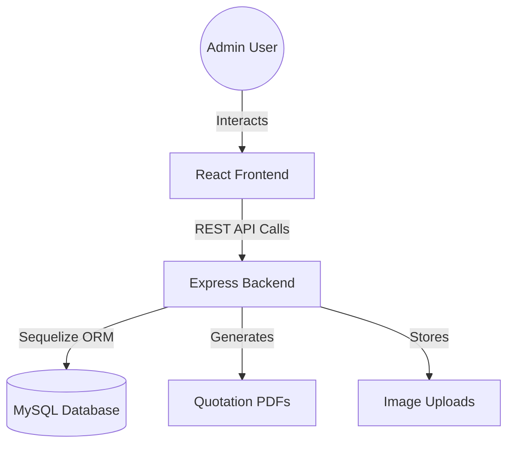
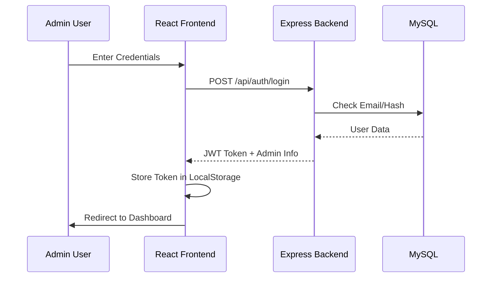

# 🎬 Cinematic Frame Admin – Project Context

This document provides a comprehensive overview of the **Cinematic Frame Admin** ecosystem. It is designed to help developers and AI assistants understand the project structure, workflows, and architecture.

---

## 🏗️ Architecture Overview

The project follows a classic **Client-Server** architecture:

1.  **Frontend (cinematic-frame-admin):** A modern React application built with Vite, TypeScript, and Tailwind CSS. It serves as the administrative dashboard.
2.  **Backend (cinematic-backend):** A Node.js + Express server using Sequelize ORM to interact with a MySQL database.



---

## 📂 Project Structure

### 1. Backend (`/cinematic-backend`)
| Path | Description |
|---|---|
| `server.js` | Entry point, server configuration, and middleware mounting. |
| `src/config/database.js` | Sequelize connection & MySQL settings. |
| `src/models/` | Sequelize models (User, Quotation, Portfolio, Service, etc.). |
| `src/controllers/` | Business logic for each route. |
| `src/routes/` | API route definitions. |
| `src/middleware/` | Auth (JWT), API Logging, and Error Handling. |
| `src/utils/seeder.js` | Database initialization and sample data. |
| `uploads/` | Storage for portfolio and service images. |

### 2. Frontend (`/cinematic-frame-admin`)
| Path | Description |
|---|---|
| `src/main.tsx` | App entry point. |
| `src/App.tsx` | Routing and layout wrapper. |
| `src/pages/` | Individual view components (Dashboard, Quotations, etc.). |
| `src/components/` | Reusable UI components (Sidebar, Navbar, Modals). |
| `src/lib/api.ts` | Centralized Axios client for all API calls. |
| `src/contexts/` | Global state management (AuthContext). |
| `src/hooks/` | Custom React hooks. |

---

## 🛠️ Core Workflows

### 1. Authentication Workflow


### 2. Quotation Management
- **Creation:** Leads come in via public API (or manual entry).
- **Processing:** Admin views details, updates status (Contacted, Booked).
- **Generation:** Admin generates PDF quotations for clients.

### 3. Portfolio Management
- **Upload:** Admin uploads images (via Multer).
- **Mapping:** Backend saves file paths and associates them with categories/projects.
- **Frontend:** Gallery displays images from the `/uploads` static folder.

---

## 📊 Database Schema (Sequelize)

- **Users:** Admin accounts (Email, Username, Hashed Password).
- **Quotations:** Leads info (Name, Event Type, Budget, Status).
- **Portfolios:** Albums (Title, Category, Cover Image, Array of Images).
- **Services:** Service list and pricing packages.
- **Clients:** CRM data (Total Spent, Project Count).
- **Bills:** Financial records and PDF generation data.

---

## 🚀 Development Workflow

### Starting the Project
1.  **Database:** Ensure MySQL is running and `pixcel_db` exists.
2.  **Backend:**
    ```bash
    cd cinematic-backend
    npm run dev
    ```
3.  **Frontend:**
    ```bash
    cd cinematic-frame-admin
    npm run dev
    ```

### Environment Variables (.env)
- **Backend:** `PORT`, `DB_HOST`, `DB_NAME`, `DB_USER`, `DB_PASSWORD`, `JWT_SECRET`.
- **Frontend:** `VITE_API_URL` (usually `http://localhost:5000/api`).

---

## 📝 Coding Principles
- **Clean API:** Always return `{ success: true, data: [...] }` or `{ success: false, message: "..." }`.
- **Logging:** Backend uses `apiLogger.js` to track all requests in the database.
- **Typing:** Use TypeScript interfaces in the frontend (defined in `api.ts`).
